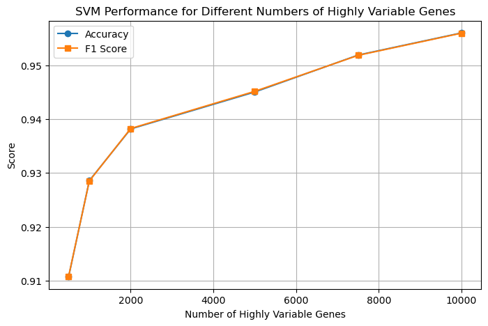

# Final Project Report
# Introduction  

## Literature Review  

Accurate classification of cancer types based on RNA-sequencing data is a crucial task in computational oncology, with significant implications for diagnosis. Our goal is to use ML to predict the type of cancer based on RNA-sequencing data. This classification is essential in the clinic to support and validate histology and will help guide the treatment of patients.

Previous studies have laid a strong groundwork for us to expand upon. Jaskowiak et al. compared 4 clustering methods and 12 distance measures and concluded that k-medoids and hierarchical clustering with average linkage were superior over complete or single linkage[1]. Moreover, Freyhult et al. pinpointed that the preprocessing steps in using RNAseq data can majorly influence performance[2]. Since we are working with high dimensional data, we aim to test multiple feature reduction techniques like those employed by David Kallberg’s group analyzing 11 such techniques[3].

### Dataset Description

Our dataset contains 6 files containing gene expression profiles of 6 cancer types, present in sample x genes format with 2,952 patient samples and 20,531 genes. The values represent the counts of gene products in the sample.

[Dataset link](http://zenodo.org/records/8192916)[4][5]

## Problem Definition

### Problem
Diagnosing cancer and correct subtype classification from samples collected from patients is crucial in effectively treating cancer. To aid this time-sensitive task, we propose to apply ML techniques for accurately categorizing cancer types by analyzing expression levels of cancer type-specific *signature* genes as a supplementary tool for the clinicians to accelerate diagnosis procedure.

### Motivation
Humans have ~20,000 protein-coding genes. Using manual techniques to identify differentially expressed(DE) genes among conditions is impractical, necessitating the use of sophisticated models to churn this very-high dimensional data. Moreover, DE gene identification is an important step in bioinformatics pipelines for downstream analyses.

### Data Preprocessing Methods Implemented

#### a. Merging Datasets Based on Common Genes
We wanted to ensure that all the datasets we used had expression values present for a common set of genes. This would allow our model to get trained on features that are present across the dataset and are not missing. Thus, we decided to find the common genes shared between all the datasets and merged all 6 gene expression files (each corresponding to a type of cancer) into one dataset for downstream model training. The resulting file contained labels corresponding to each of the cancer types, and their expression value for each subject. In total we had 11,313 genes shared between 2,952 samples that we used for our analysis.

#### b. SMOTE to deal with class imbalance
As there was an imbalance in the number of observations between classes, we decided to use the SMOTE algorithm (Synthetic Minority Oversampling Technique) which synthetically created data points for under-represented classes. This was done to avoid the model being biased towards over-represented data. Upon using SMOTE, we balanced the classes such that each class now had 606 data points.
The Barplot below shows the number of samples in each class type before and after using SMOTE.

#### Before SMOTE

#### After SMOTE

#### c. Data Normalisation
As our data was already Z-score normalized (with the mean value = 0 and standard deviation = 1 for each gene), we did not need to do any additional normalization step. This is done to understand the relative expression levels of genes across samples without being influenced by differences in absolute expression levels or dynamic ranges. The figure below shows the distribution of z-score normalized counts in our final merged dataset for a random gene. We observe the mean as 0 and a standard deviation of 1 as the data has been z-score normalized.

#### d. Data Imputation and QC
During exploratory data QC, we did not encounter any major problems with the datasets in terms of missing observations, or extreme outliers. 

#### e. Feature Engineering and Dimensionality Reduction
A common step in RNAseq analyses is to find highly variable genes. Typically, the top 1000-10000 highly variable genes are used for downstream analyses. As these genes represent the most variable components across different classes, they are ideal for training our model. We tested the use of multiple numbers of highly variable genes and decided to use 5000 genes for our analysis as it provided us with great accuracy while maintaining acceptable runtimes.
We applied principal component analysis to the dataset. It works by transforming high-dimensional data into a lower-dimensional space while maximizing the variance of the data in the new space. Below is the plot of the first two principal components from the PCA calculations. As expected, given the variance explained by each PC is very low, we don't see any clear clustering with PCA. 

Next, we applied TSNE to try non-linear Dimensionality Reduction. A t-SNE plot is a visualization tool created using the t-distributed Stochastic Neighbor Embedding (t-SNE) algorithm. It is used to represent high-dimensional data in a lower-dimensional space while preserving the relationships and structure of the original data as much as possible. Below is the t-SNE visualization of gene expression profiles across six cancer types using 5000 highly variable genes. Each point represents a tumor sample, colored by cancer type. The clustering patterns reflect distinct transcriptional landscapes among cancer types. We can see Cancer type-specific clusters form. We also observe some overlap between clusters which may suggest partial transcriptional similarity or shared pathways among these cancers. 

## ML Algorithms/Models Implemented

#### Support Vector Machine (Supervised)
We chose to implement a Support Vector Machine for the cancer classification task because this model is robust at handling high-dimensional data, particularly with the Radial Basis Function (RBF) kernel, which is commonly used to map data points into a higher-dimensional space where a linear decision boundary can be constructed to separate classes. In addition to this, the RBF kernel also allows the model to capture non-linear patterns in the gene expression data, enhancing the performance of the model in differentiating between cancer types.

Moreover, SVM is robust to overfitting as it uses a regularization parameter (C), which helps it to generalize well on new or unseen data. Furthermore, compared to other complex model architectures, SVMs requires less time and computational resources, which makes it feasible to use for real-time cancer diagnostic applications. Overall, by implementing SVM with an RBF kernel, we leverage its strengths in handling high-dimensional and complex biological data while ensuring robustness and generalizability for diagnostic applications.

#### DBSCAN (Unsupervised)
In the validation dataset, we found, there are 6 cancer subtypes that the samples were categorized into. Realizing this, we wanted to see if the gene expression data for these samples would naturally cluster into 6 categories. We chose DBSCAN as our clustering algorithm because, unlike other techniques, it does not require specifying the number of clusters beforehand. Instead, the algorithm determines the number of clusters based on the data itself. Our goal was to see if applying DBSCAN would naturally result in six clusters corresponding to our cancer subtypes. DBSCAN is also very good for noise detection, which was another reason to use this algorithm. Given, there are around 3000 samples, each with 11,000+ gene expression features, we knew that there would likely be some biological noise that needed to be filtered out and that DBSCAN could help with this. 

#### KMeans (Unsupervised)
Given that our dataset lacked labeled classes, K-Means offered an unsupervised approach to explore potential groupings based on feature similarity. Its ability to scale efficiently to large datasets and provide a clear assignment of each point to a cluster made it well-suited for our initial exploratory analysis. Additionally, since we could reasonably estimate the number of clusters based on domain knowledge or label counts, K-Means provided a straightforward starting point for evaluating whether the data exhibited natural separation in feature space. While our results suggested weak clustering structure, applying K-Means still allowed us to quantify this through metrics like silhouette score and to visualize possible patterns using PCA projections.

#### Deep Learning
We implemented a deep feedforward neural network for classification due to its ability to learn complex patterns in high-dimensional gene expression data. The architecture uses 3 hidden layers to progressively capture relevant biological features through non-linear patterns, enabling the model to capture relationships between gene expression profiles and cancer subtypes. The model incorporates components for robust performance such as - Batch normalization which stabilize training by reducing internal covariate shift, Dropout regularization (p=0.5) prevents overfitting by turning off certain nodes, Adam optimizer with weight decay (λ=1e-5) that enables adaptive learning, ReduceLROnPlateau scheduler that dynamically adjusts learning rates during training plateaus. We also implemented early stopping to prevent overfitting. The final model outputs class probabilities through a softmax layer, enabling interpretability of cancer type predictions. We used 70% of the data for training, 20% for validation and 10% for testing our model. 

#### Tree-based Ensemble Models
We wanted to try implementing XGBoost, Random Forest and Extra Tree classifier models, mainly to obtain the important genes that help in differentiating the cancer types. 

#### XGBoost
We implemented XGBoost for cancer classification due to its ability to efficiently handle high-dimensional data with the help of gradient boosting on decision trees. It is particularly suitable for tasks which have complex, non-linear interactions, such as gene expression profiles, by building an ensemble of weak learners that collectively improve predictive performance. The model was configured with the default learning rate, 0.3, allowing the model to maintain convergence stability. A maximum tree depth of 6 enabled each tree to capture intricate patterns without overfitting to noise in the data. To prevent overfitting, we implemented early stopping, halting the training process if the model’s performance on a validation set did not improve over 10 consecutive rounds. These choices helped us build a reliable and accurate model suitable for clinical use for differentiating cancer types.

#### Random Forest and Extra Tree Classifiers
Random Forest uses bagging and feature subsetting to reduce variance and entropy with each split, thus avoiding overfitting. Extra Trees adds even more randomness by using random split thresholds. Both models are, in general, good choices for handling high-dimensional data and are less sensitive to irrelevant features since they perform feature selection internally during the split process. They calculate the Gini importance of each feature that identifies the important features. This is important as identifying biomarker genes is required for distinguishing cancer types. They are well-suited for the multiclass classification task.

## Results and Discussion

### Support Vector Machine

Our SVM Classifier trained on top 5000 highly variable genes performed quite well with a mean accuracy of 0.95 across all the classes. We looked at several metrics to determine the performance of this model:

#### a. Macro F1

Macro F1 provides a balanced measure of precision and recall as both false positives and false negatives can have serious consequences in cancer diagnosis. This score also makes sure that no single cancer type dominates the model’s performance and that it can be generalized across the dataset. The SVM model achieved an impressive Macro F1 score of 0.9453, reflecting its strong overall performance across all classes.

#### b. Confusion Matrix

 Confusion Matrix illustrates the classification model's performance in predicting six cancer types. The diagonal values represent correct predictions, while off-diagonal values indicate misclassifications. The model demonstrates high accuracy, with minimal errors across all classes as shown below.

#### c. One-vs-Rest multiclass ROC
 
Multiclass ROC plots the True Positive Rate against the False Positive Rate at different thresholds and helps us understand which cancer types are most easily discriminated against. As shown in the plot below, the Area Under Curve (AUC) values are quite high across all cancer types, with three classes having a perfect score of 1 and the other classes having values close to 1. This indicates the model can distinguish between each cancer type and all others with remarkable accuracy. The steep vertical rise of all curves near the top right corner indicates that the model achieves high true positive rates with minimal false positives, which is ideal for diagnostic applications.
 

#### d. Balanced Accuracy
 Balanced Accuracy represents the arithmetic mean of sensitivity and specificity and will give equal weight to each cancer type. In our SVM model, we got a balanced accuracy score of 94.50% which is a strong score for our classification model

### Hyperparameter tuning
We also looked at using different hyperparameters to assess the best F1 Score -

#### a. Regularization

 We looked at the performance of the SVM classifier with varying regularization parameter C using 5000 highly variable genes. The graph below plots Accuracy (blue line) and F1 Score (orange line) against C values. Both metrics improve significantly as C increases, indicating better model performance with reduced regularization. Beyond C = 10^0, the metrics plateau, which suggests further increases in C provide diminishing returns in performance. 

 

#### b. Highly Variable Genes

 We also looked at the SVM classifier performance across different numbers of highly variable genes. The graph below plots Accuracy (blue line) and F1 Score (orange line) against the number of HVGs. Both metrics show a consistent upward trend as the number of HVGs increases, with significant improvement observed from 1000 to 2000 HVGs. Beyond 4000 HVGs, the metrics continue to rise but at a slower rate, indicating smaller returns on performance gains with additional genes. We decided to use 5000 genes in our final model as it produced an adequate classification accuracy with an acceptable runtime. 

  

#### Analysis
Overall the support vector machine model trained on our dataset using the top 5000 highly variable genes showed exceptional accuracy in classifying the cancer subtypes. As demonstrated by the Confusion Matrix, the model can correctly discriminate between the cancer types for all the classes while having a minimal number of misclassifications. The Area Under Curve values for all the classes lie between 0.98-1.00 which demonstrates almost perfect classification by the model. We believe that the success of the model relied upon focusing on the top 5,000 highly variable genes which effectively filtered biological noise while retaining critical biomarkers that the radial basis function kernel was able to utilize to learn the complex relation.

### DBSCAN
Our DBSCAN clustering was not able to cluster our data as we had hoped. It was only able to identify 2 clusters from our dataset.

In choosing epsilon for our DBSCAN, we decided to leverage the elbow effect and plotted the distance of the 4th nearest neighbor vs the points. As can be seen in the first graph, the ideal epsilon that we decided to select was 25 as that is around where the elbow of the graph is formed. Points below this threshold are more likely to be a part of clusters and points above are more likely to be outliers. 

As mentioned before, prior to performing DBSCAN, we applied PCA to reduce the number of features in the gene expression data to 1000 principal components. We then further reduced these 1000 principal components to 10 utilizing the SelectKBest algorithm. Visualizing how our DBSCAN algorithm clustered the data in 10-dimensional space is impossible, so we decided to utilize the t-SNE algorithm to try and represent this high-dimensional data in a lower-dimensional space while preserving the relationships and structure of the original data as much as we could. Our DBSCAN algorithm produced 2 clusters, one with 2899 points (represented by the turquoise points) and one with 4 points (represented by the yellow points). The purple points represent noise. This shows that the data cannot easily be clustered at all utilizing DBSCAN given the fact that we chose the ideal epsilon value utilizing the elbow method and still got 2 very unbalanced clusters. 

We used the following metrics to measure the performance of DBSCAN:

#### Silhouette coefficient
 Silhouette score combines information about cohesion and separation and will help determine if the clusters discovered actually correspond to different cancer types.  Our DBSCAN model produced a silhouette score of 0.68713. Silhouette scores range from -1 to 1, with values closer to 1 indicating well-defined, distinct clusters. A score of 0.68713 suggests that the clusters have fairly good separation and cohesion, meaning the clustering captures a lot of the structure in the data.

#### Number of Clusters 
Our DBSCAN model was only able to produce two clusters even though we expected six clusters, one for each cancer subtype. This indicates that the data does not naturally cluster into the 6 categories as we would have hoped.

#### Analysis 

Our visualization and metrics suggest that while our dimensionality reduction using PCA was successful, retaining 89.91% of the dataset's variance, the clustering results from the DBSCAN models were less effective than expected. Despite aiming to classify the data into six cancer types, the model only formed two clusters, with a silhouette score of 0.68713, indicating fairly good cluster separation, though not with the number of clusters we would have liked to see. However, these two clusters were extremely unbalanced as shown in the t-SNE visualization above, indicating that DBSCAN is not a suitable algorithm to properly cluster the data. An explained variance such as the one given before may highlight the issue of redundancy. Redundancy in the high-dimensional gene expression data may have obscured distinct cluster boundaries. This redundancy, combined with potential overlap in gene expression profiles across cancer types, likely contributed to the model’s limited performance. Our next steps include exploring alternative feature selection to reduce redundancy and experimenting with different clustering methods or parameter tuning to better capture the underlying structure of the data.

### KMeans
Our K-Means was able to cluster into 6 different groups, however the clusters did not have distinct boundaries.

As shown in the plot, we identified six clusters using K-Means, each represented by a distinct color and with centroids marked by red Xs. While some separation between clusters is observable, there is significant overlap among many of the groups, particularly near the center of the plot. 

As seen in the graph, the distribution is highly imbalanced, with clusters 2, 3, and 5 containing the majority of points, while clusters 0, 1, and especially 4 contain far fewer. This imbalance suggests that the clustering algorithm grouped a large portion of the data into only a few clusters, potentially merging distinct patterns or failing to capture smaller groups. 

#### Metrics
a. Silhouette Score: 0.008 - This implies that our clusters have a fair amount of overlapping  
b. Cluster Membership Count: We can see that three clusters dominate the chart

#### Analysis
After scaling the feature data, we applied PCA to reduce dimensionality for visualization and then performed K-Means clustering with 6 clusters. The PCA-reduced 2D scatter plot shows that while centroids are clearly positioned, there is significant overlap among the clusters, and few visually distinct boundaries between them. The cluster membership bar chart also indicates that the clustering is imbalanced, with three clusters dominating the distribution and others containing far fewer points. This imbalance and overlap are further reflected in the overall silhouette score of 0.008, which is very close to zero, suggesting that most points lie near decision boundaries or may be misclustered. Taken together, these results suggest that the dataset does not naturally separate into well-defined clusters under K-Means, and the features may not support strong cluster structure in their current form.

### Deep Learning
The deep learning model performed quite well giving an overall accuracy of 95.95% on the test dataset. We used the following metrics to measure the performance of the model

#### Confusion Matrix
Confusion Matrix illustrates the classification model's performance in predicting six cancer types. The diagonal values represent correct predictions, while off-diagonal values indicate misclassifications. The model demonstrates high accuracy, with minimal errors across all classes as shown below.

#### One vs rest multiclass ROC
Multiclass ROC plots the True Positive Rate against the False Positive Rate at different thresholds and helps us understand which cancer types are most easily discriminated against. As shown in the plot below, the Area Under Curve (AUC) values are quite high across all cancer types, with three classes having a perfect score of 1 and the other classes having values close to 1. This indicates the model can distinguish between each cancer type and all others with remarkable accuracy. The steep vertical rise of all curves near the top right corner indicates that the model achieves high true positive rates with minimal false positives, which is ideal for diagnostic applications.

#### Balanced accuracy
Balanced Accuracy represents the arithmetic mean of sensitivity and specificity and will give equal weight to each cancer type. In our DL model, we got a balanced accuracy score of 0.9498% which is a strong score for our classification model

#### Macro F1
Macro F1 provides a balanced measure of precision and recall as both false positives and false negatives can have serious consequences in cancer diagnosis. This score also makes sure that no single cancer type dominates the model’s performance and that it can be generalized across the dataset. The DL model achieved an impressive Macro F1 score of 0.9512, reflecting its strong overall performance across all classes.

### Tree-based Ensemble Models
With the goal of using tree-based models to identify biomarker genes that distinguish cancer types, we implemented tree-based models like XGBoost, Random Forest, and Extra Tree Classifiers. However, all these models suffered from the problem of overfitting, as our data is very high-dimensional and we do not have enough data points in comparison with the number of genes. All the models provided an accuracy of 1.0 consistently for multiple combinations of hyperparameters and values used as can be seen from below accuracy plots depicting different values of hyperparameter chosen. Supporting the above observation, the models performed well and did not overfit when we applied dimensionality reduction like PCA before feeding the data into these models. However, applying PCA transforms the features into Z-space and it is hard to recover the original signature genes that actually contribute to differentiating cancer types.

 

### Comparative analysis of all ML models

Overall, the supervised learning algorithms performed much better than the unsupervised classification algorithms did. With the deep learning approach, where we designed a neural network with 3 hidden layers that utilized a ReLU activation function, batch normalization, and dropout to reduce overfitting, we were able to achieve an overall accuracy of 95.95%. Furthermore, we achieved a F1 score of 0.9512, indicating a very good recall and precision and minimal false positives and negatives, which are both extremely important in cancer diagnosis. We were also able to get a similar level of performance utilizing SVM, ultimately achieving an accuracy of 95%. Our F1 score for this model was once again a strong 94.53%, achieving excellent precision and recall. 

We also tested this model against highly variable genes as explained above, which tend to be even more sporadic than regular genes due to the fact that their expression levels tend to work somewhat unpredictably. However, even utilizing 5000 of these genes, we were able to see an F1 score of close to 95%, further explaining the robustness of this model. Our tree based ensemble models were the worst performing supervised learning methods as they suffered from overfitting. This could be seen when the models would all have an accuracy of 1 no matter the combination of hyperparameters. This was due to the high dimensionality of the data. We attempted to utilize PCA to help performance against the high dimensional data however this made it hard to understand which genes were contributing to cancer, rendering the model useless. However, besides our tree ensemble models, the supervised learning algorithms all performed very well. 

Our unsupervised learning algorithms were unable to properly cluster the data as we would’ve liked. For DBSCAN, we were hoping that the data would naturally cluster into 6 categories, matching up to the unique number of cancer subtypes. However, the model ended up only forming 2 clusters, with a silhouette score of 0.6871, which actually indicates that the points are pretty well clustered and are quite similar to the rest of the points in their respective clusters. However, the issue is that these two clusters were extremely unbalanced as shown in the t-SNE cluster visualization above, with thousands of points in one cluster and only a handful in another one. This shows that DBSCAN is not competent enough to properly cluster the data. After scaling and applying PCA for visualization, we also ran K-Means with 6 clusters. Though the 2D plot was able to create six clusters, they showed major overlap with unclear boundaries, and the bar chart revealed a skewed distribution across clusters. A low silhouette score of 0.008 suggests poor separation and potential misclassification. This likely reflects that the features lack strong inherent structure, making K-Means a poor fit for this dataset. As such, both of our unsupervised learning algorithms performed pretty poorly and worse than we would’ve wanted. 

### Next Steps

We implemented 5-6 ML models in this project to accurately classify cancer types. As we saw in the results sections above, some models performed very well and some not so well, mainly because they were overfitting due to the high dimensionality of the data. Some improvements for the future include tuning hyperparameters for the models that gave good results to improve the accuracy. Further, we can look at alternate unsupervised clustering algorithms that provide better clustering than DBSCAN and K-means. The deep learning model can also be made more robust by experimenting with different architectures that capture the patterns in the data well to more accurately predict the cancer types. Further, viewing our results and fine-tuning the models, honoring the underlying biological differences across cancer types, also becomes extremely important. Finally verifying the obtained biomarker so that they can be further investigated saves resources and, more importantly, time, which is crucial in these time-sensitive cases.

## Gantt Chart

If you are unable to view, [please click here](https://gtvault-my.sharepoint.com/:x:/g/personal/akrishna311_gatech_edu/Eadiz29vLKpCnRs4mFdZ65sBznO7p0sx_qCukL3io7JnZw)

<iframe width="800" height="700" frameborder="2" scrolling="no" src="https://1drv.ms/x/c/7413787cefd7dd8b/IQQHojiVklqHS4MdAunuMfn7AcaTi3X3xg2NidJZ7TvC3l4?em=2&wdAllowInteractivity=False&Item='Sheet1'!B2%3ACZ40&wdInConfigurator=True&wdInConfigurator=True"></iframe>

### Contributions

| Name       | Contributions|        
|:-------------|:------------------|
| Hina Gaur          | XGBoost implementation and evaluation, report writing, presentation slides  | 
| Anagha Mohana Krishna  | SVC evaluation comparing various HVG values, Random Forest implementation and finetuning, Next Steps in report, Presentation slides, updated webpage |
| Mridul Anand           |  | 
| Ani Vedartham | DBScan model implementation, DBScan elbow graph, DBScan clusters visualization, quantitative metrics, analysis, comparative analysis of all ML models, presentation slides |
| Vedu Arya | K means model implementation, scatter plot, bar graph, metrics, and analysis. Comparative analysis of all ML models. Presentation slides. |

### References

1. L. Vidman, D. Källberg, and P. Rydén, “Cluster analysis on high dimensional RNA-seq data with applications to cancer research - An evaluation study,” PLOS ONE, vol. 14, no. 12, p. e0219102, Dec. 2019, doi: https://doi.org/10.1371/journal.pone.0219102.
2. ‌E. Freyhult, M. Landfors, J. Önskog, T. R. Hvidsten, and P. Rydén, “Challenges in microarray class discovery: a comprehensive examination of normalization, gene selection and clustering,” BMC Bioinformatics, vol. 11, no. 1, Oct. 2010, doi: https://doi.org/10.1186/1471-2105-11-503.
3. D. Källberg, L. Vidman, and Patrik Rydén, “Comparison of Methods for Feature Selection in Clustering of High-Dimensional RNA-Sequencing Data to Identify Cancer Subtypes,” Frontiers in Genetics, vol. 12, Feb. 2021, doi: https://doi.org/10.3389/fgene.2021.632620.
4. M. J. Goldman et al., “Visualizing and interpreting cancer genomics data via the Xena platform,” Nature Biotechnology, vol. 38, no. 6, pp. 675–678, May 2020, doi: https://doi.org/10.1038/s41587-020-0546-8.
5. J. N. Weinstein et al., “The Cancer Genome Atlas Pan-Cancer analysis project,” Nature Genetics, vol. 45, no. 10, pp. 1113–1120, Sep. 2013, doi: https://doi.org/10.1038/ng.2764.
6. GeeksforGeeks, “F1 Score in Machine Learning,” GeeksforGeeks, Dec. 27, 2023. https://www.geeksforgeeks.org/f1-score-in-machine-learning/

[Back to home](./)
