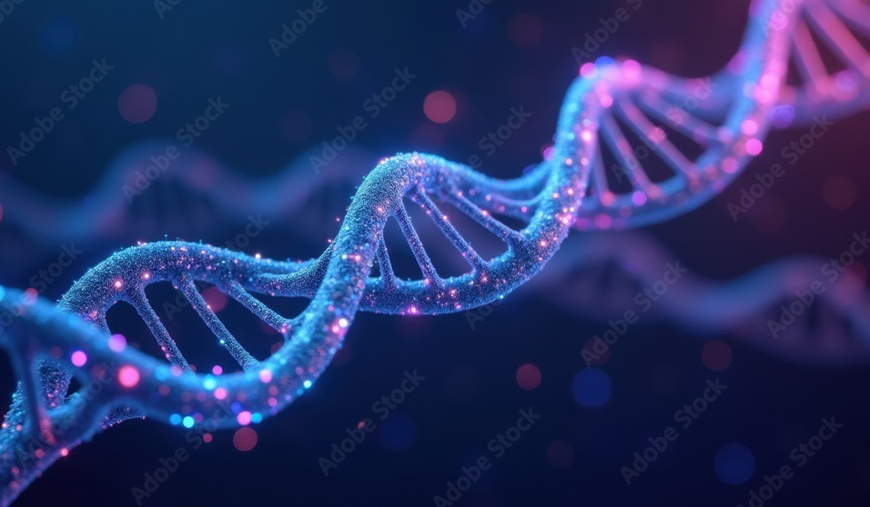

## Context

RNA sequencing (RNA-seq) has revolutionized cancer research by providing valuable insights into the mechanisms underlying different types of cancer at molecular resolution. RNAseq profiles enable the comprehensive analysis of gene expression levels and RNA modifications across various cancer types. It helps in identifying biomarkers for diagnosis and offers insights into the complex regulatory networks driving cancer initiation and progression.

Machine learning approaches have become indispensable in the analysis of RNA-seq data due to the volume and complexity of the data generated. Traditional methods fail to handle and make sense of such multidimensional data, where thousands of genes and their expressions need to be analyzed. ML algorithms are powerful tools to identify patterns within RNAseq data that are indicative of different cancer types and subtypes. By integrating supporting data like clinical information, these algorithms aids in improving the accuracy of cancer classification. These insights are critical for enhancing our understanding of cancer biology and for development of effective, personalized medicine. 

## Project Proposal
[Find our project proposal here](./proposal.html).

## View our progress
[Find our midpoint report with our analysis and results here](./midpoint_submission/mid_point_report.html).

We wish to opt-in for being considered for the outstanding project award.

## Group 55 Team Members

1. Hina Gaur
2. Mridul Anand
3. Anagha Mohana Krishna
4. Ani Vedartham
5. Vedansh Arya