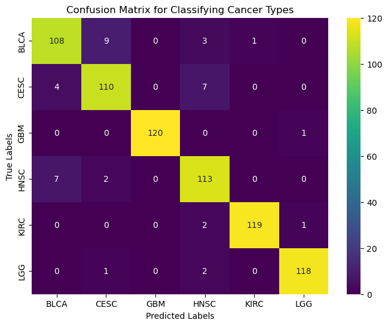
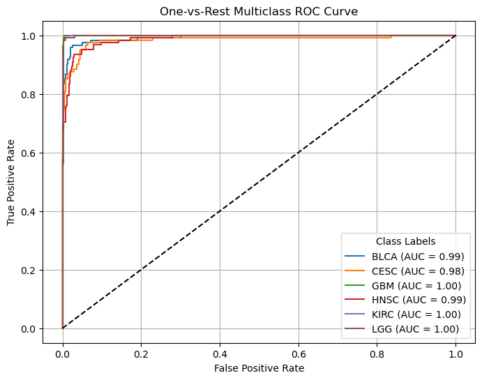
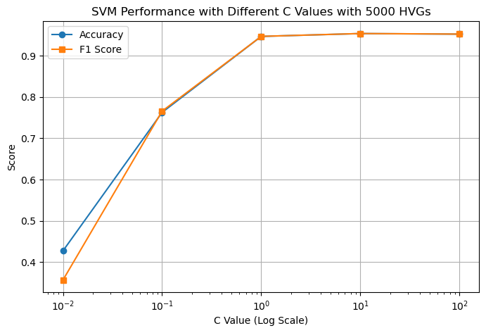
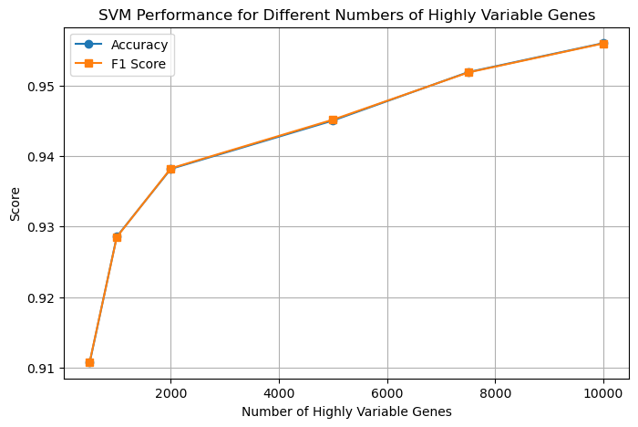

# Project Proposal

# Introduction  

## Literature Review  

Accurate classification of cancer types based on RNA-sequencing data is a crucial task in computational oncology, with significant implications for diagnosis. Our goal is to use ML to predict the type of cancer based on RNA-sequencing data. This classification is essential in the clinic to support and validate histology and will help guide the treatment of patients.

 Previous studies have laid a strong groundwork for us to expand upon. Jaskowiak et al. compared 4 clustering methods and 12 distance measures and concluded that k-medoids and hierarchical clustering with average linkage were superior over complete or single linkage[1]. Moreover, Freyhult et al. pinpointed that the preprocessing steps in using RNAseq data can majorly influence performance[2]. Since we are working with high dimensional data, we aim to test multiple feature reduction techniques like those employed by David Kallberg’s group analyzing 11 such techniques[3].

### Dataset Description

Our dataset contains 6 files containing gene expression profiles of 6 cancer types, present in sample x genes format with 2,952 patient samples and 20,531 genes. The values represent the counts of gene products in the sample.

[Dataset link](http://zenodo.org/records/8192916)[4][5]

## Problem Definition

### Problem
Diagnosing cancer and correct subtype classification from samples collected from patients is crucial in effectively treating cancer. To aid this time-sensitive task, we propose to apply ML techniques for accurately categorizing cancer types by analyzing expression levels of cancer type-specific *signature* genes as a supplementary tool for the clinicians to accelerate diagnosis procedure.

### Motivation
Humans have ~20,000 protein-coding genes. Using manual techniques to identify differentially expressed(DE) genes among conditions is impractical, necessitating the use of sophisticated models to churn this very-high dimensional data. Moreover, DE gene identification is an important step in bioinformatics pipelines for downstream analyses.

### Data Preprocessing Methods Implemented

#### a. Merging Datasets Based on Common Genes
We wanted to ensure that all the datasets we used had expression values present for a common set of genes. This would allow our model to get trained on features that are present across the dataset and are not missing. Thus, we decided to find the common genes shared between all the datasets and merged all 6 gene expression files (each corresponding to a type of cancer) into one dataset for downstream model training. The resulting file contained labels corresponding to each of the cancer types, and their expression value for each subject. In total we had 11,313 genes shared between 2,952 samples that we used for our analysis.

#### b. SMOTE to deal with class imbalance
As there was an imbalance in the number of observations between classes, we decided to use the SMOTE algorithm (Synthetic Minority Oversampling Technique) which synthetically created data points for under-represented classes. This was done to avoid the model being biased towards over-represented data. Upon using SMOTE, we balanced the classes such that each class now had 606 data points.
The Barplot below shows the number of samples in each class type before and after using SMOTE.

#### Before SMOTE

#### After SMOTE

#### c. Data Normalisation
As our data was already Z-score normalized (with the mean value = 0 and standard deviation = 1 for each gene), we did not need to do any additional normalization step. This is done to understand the relative expression levels of genes across samples without being influenced by differences in absolute expression levels or dynamic ranges. The figure below shows the distribution of z-score normalized counts in our final merged dataset for a random gene. We observe the mean as 0 and a standard deviation of 1 as the data has been z-score normalized.

#### d. Data Imputation and QC
During exploratory data QC, we did not encounter any major problems with the datasets in terms of missing observations, or extreme outliers. 

#### e. Feature Engineering and Dimensionality Reduction
A common step in RNAseq analyses is to find highly variable genes. Typically, the top 1000-10000 highly variable genes are used for downstream analyses. As these genes represent the most variable components across different classes, they are ideal for training our model. We tested the use of multiple numbers of highly variable genes and decided to use 5000 genes for our analysis as it provided us with great accuracy while maintaining acceptable runtimes.
We applied principal component analysis to the dataset. It works by transforming high-dimensional data into a lower-dimensional space while maximizing the variance of the data in the new space. Below is the plot of the first two principal components from the PCA calculations. As expected, given the variance explained by each PC is very low, we don't see any clear clustering with PCA. 

Next, we applied TSNE to try non-linear Dimensionality Reduction. A t-SNE plot is a visualization tool created using the t-distributed Stochastic Neighbor Embedding (t-SNE) algorithm. It is used to represent high-dimensional data in a lower-dimensional space while preserving the relationships and structure of the original data as much as possible. Below is the t-SNE visualization of gene expression profiles across six cancer types using 5000 highly variable genes. Each point represents a tumor sample, colored by cancer type. The clustering patterns reflect distinct transcriptional landscapes among cancer types. We can see Cancer type-specific clusters form. We also observe some overlap between clusters which may suggest partial transcriptional similarity or shared pathways among these cancers. 

## ML Algorithms/Models Implemented

#### a. Support Vector Machine (Supervised)

We chose to implement a Support Vector Machine for the cancer classification task because this model is robust at handling high-dimensional data, particularly with the Radial Basis Function (RBF) kernel, which is commonly used to map data points into a higher-dimensional space where a linear decision boundary can be constructed to separate classes. In addition to this, the RBF kernel also allows the model to capture non-linear patterns in the gene expression data, enhancing the performance of the model in differentiating between cancer types.

Moreover, SVM is robust to overfitting as it uses a regularization parameter (C), which helps it to generalize well on new or unseen data. Furthermore, compared to other complex model architectures, SVMs require less time and computational resources, which makes it feasible to use for real-time cancer diagnostic applications. Overall, by implementing SVM with an RBF kernel, we leverage its strengths in handling high-dimensional and complex biological data while ensuring robustness and generalizability for diagnostic applications.

#### b. DBscan (Unsupervised)
In the validation dataset, we found, there are 6 cancer subtypes that the samples were categorized into. Realizing this, we wanted to see if the gene expression data for these samples would naturally cluster into 6 categories. We chose DBscan as our clustering algorithm because, unlike other techniques, it does not require specifying the number of clusters beforehand. Instead, the algorithm determines the number of clusters based on the data itself. Our goal was to see if applying DBSCAN would naturally result in six clusters corresponding to our cancer subtypes. DBScan is also very good for noise detection, which was another reason to use this algorithm. Given, there are around 3000 samples, each with 11,000+ gene expression features, we knew that there would likely be some biological noise that needed to be filtered out and that DBScan could help with this. 

## Results and Discussion

### Support Vector Machine

Our SVM Classifier trained on top 5000 highly variable genes performed quite well with a mean accuracy of 0.95 across all the classes. We looked at several metrics to determine the performance of this model:

#### a.Macro F1

 Macro F1 provides a balanced measure of precision and recall as both false positives and false negatives can have serious consequences in cancer diagnosis. This score also makes sure that no single cancer type dominates the model’s performance and that it can be generalized across the dataset. The SVM model achieved an impressive Macro F1 score of 0.9453, reflecting its strong overall performance across all classes.

#### b. Confusion Matrix

 Confusion Matrix illustrates the classification model's performance in predicting six cancer types. The diagonal values represent correct predictions, while off-diagonal values indicate misclassifications. The model demonstrates high accuracy, with minimal errors across all classes as shown below.

 

 #### c. One-vs-Rest multiclass ROC
 
 Multiclass ROC plots the True Positive Rate against the False Positive Rate at different thresholds and helps us understand which cancer types are most easily discriminated against. As shown in the plot below, the Area Under Curve (AUC) values are quite high across all cancer types, with three classes having a perfect score of 1 and the other classes having values close to 1. This indicates the model can distinguish between each cancer type and all others with remarkable accuracy. The steep vertical rise of all curves near the top right corner indicates that the model achieves high true positive rates with minimal false positives, which is ideal for diagnostic applications.
 
  

#### d. Balanced Accuracy
 Balanced Accuracy represents the arithmetic mean of sensitivity and specificity and will give equal weight to each cancer type. In our SVM model, we got a balanced accuracy score of 94.50% which is a strong score for our classification model

We also looked at using different hyperparameters to assess the best F1 Score

#### A. Regularisation

 We looked at the performance of the SVM classifier with varying regularization parameter C using 5000 highly variable genes. The graph below plots Accuracy (blue line) and F1 Score (orange line) against C values. Both metrics improve significantly as C increases, indicating better model performance with reduced regularization. Beyond C = 10^0, the metrics plateau, which suggests further increases in C provide diminishing returns in performance. 

 

#### B. Highly Variable Genes

 We also looked at the SVM classifier performance across different numbers of highly variable genes. The graph below plots Accuracy (blue line) and F1 Score (orange line) against the number of HVGs. Both metrics show a consistent upward trend as the number of HVGs increases, with significant improvement observed from 1000 to 2000 HVGs. Beyond 4000 HVGs, the metrics continue to rise but at a slower rate, indicating smaller returns on performance gains with additional genes. We decided to use 5000 genes in our final model as it produced an adequate classification accuracy with an acceptable runtime. 

  
